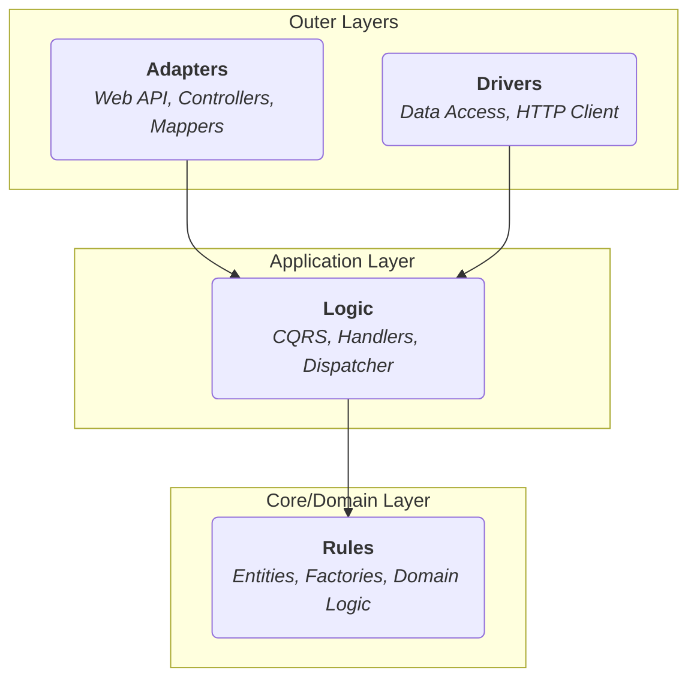

# AsyncImage Fetcher API

**A robust, concurrent backend API for bulk image downloading and retrieval, built with .NET 8 and Clean Architecture.**

This project provides a RESTful service that lets clients submit a batch of image URLs, downloads them concurrently with a configurable limit, and makes them available for later retrieval. It serves as a strong example of modern backend design principles, including Clean Architecture, CQRS, and resilient communication patterns.

---

## Table of Contents

* [Features](#features)
* [System Architecture](#system-architecture)
* [Tech Stack](#tech-stack)
* [Getting Started](#getting-started)
* [API Documentation](#api-documentation)
* [Testing Strategy](#testing-strategy)
* [CI/CD & Maintenance](#cicd--maintenance)
* [Contributing](#contributing)
* [License](#license)

---

## Features

* **Concurrent Bulk Downloading:** Submits a list of image URLs and downloads them in parallel, with a configurable `maxDownloadAtOnce` limit to control resource usage.
* **Resilient HTTP Requests:** Uses **Polly** to implement Retry and Circuit Breaker policies, making image fetching resilient to transient network failures.
* **Unique & Safe File Naming:** Generates a unique, sanitized filename for each downloaded image to prevent collisions and handle invalid characters from URLs.
* **Base64 Image Retrieval:** Provides a simple endpoint to retrieve any stored image as a Base64-encoded string.
* **Clean Architecture:** A well-defined, layered architecture that separates concerns, making the system highly testable, extensible, and maintainable.
* **CQRS Pattern:** Segregates commands (actions that change state, like downloading) from queries (actions that read state, like retrieving an image), simplifying the logic.
* **Containerized:** Fully configured to run in **Docker**, with a `docker-compose` setup for easy local development.

---

## System Architecture

The solution follows the principles of **Clean Architecture**. This design enforces a strict separation of concerns by organizing code into independent layers, with dependencies flowing only inwards.



* **Rules (Domain):** The core of the application. Contains business entities (`Image.cs`) and core logic (like the `ImageNameFactory`) that is independent of any framework.
* **Logic (Application):** Orchestrates the application's use cases using the CQRS pattern. It defines abstractions (interfaces) for what the outer layers must do, but knows nothing about *how* they do it.
* **Drivers (Infrastructure):** Implements the abstractions defined in the Logic layer. This includes services for making HTTP requests (`ImageRequestService`) and storing files (`ImageRepository`, `LocalFileStorageService`).
* **Adapters (Presentation):** The entry point to the application. For this project, it's an ASP.NET Core Web API that handles HTTP requests, validates input, and dispatches actions to the Logic layer.

---

## Tech Stack

* **Framework:** .NET 8, ASP.NET Core
* **Architecture:** Clean Architecture, CQRS
* **API:** RESTful, with auto-generated Swagger/OpenAPI documentation
* **Validation:** FluentValidation
* **Resiliency:** Polly
* **Testing:** xUnit, Moq, FluentAssertions, `WebApplicationFactory` for in-memory integration tests
* **Containerization:** Docker, Docker Compose

---

## Getting Started

### Prerequisites
* [.NET 8 SDK](https://dotnet.microsoft.com/download/dotnet/8.0)
* [Docker Desktop](https://www.docker.com/products/docker-desktop/) (for containerized setup)
* A REST client like [Postman](https://www.postman.com/) or the built-in Visual Studio `.http` file client.

### Option 1: Running with Docker (Recommended)
This is the simplest way to get the application running with its intended configuration.

1. **Clone the repository.**
2. **Run Docker Compose:** From the root of the project, run:
   ```bash
   docker-compose up --build
   ```
3. **Access the API:** The API will be available at `http://localhost:5000`. The interactive Swagger UI can be accessed at `http://localhost:5000/swagger`.

### Option 2: Running Locally with the .NET SDK
1. **Clone the repository.**
2. **Restore dependencies:**
   ```bash
   dotnet restore
   ```
3. **Run the API project:**
   ```bash
   dotnet run --project Src/Adapters/Api/AsyncImage-Fetcher-Service.Adapters.Api/AsyncImage-Fetcher-Service.Adapters.Api.csproj
   ```
4. **Access the API:** The API will be available at `http://localhost:5224` (or another port specified in the launch settings).

### Configuration
The application can be configured via environment variables.
| Variable                 | Purpose                                                                 | Example Value               |
| ------------------------ | ----------------------------------------------------------------------- | --------------------------- |
| `ASPNETCORE_ENVIRONMENT` | Sets the runtime environment (`Development`, `Production`)              | `Development`               |
| `STORAGE_DIR`            | The directory path for storing downloaded images.                       | `/app/data/images` (Docker) |

---

## API Documentation

Interactive Swagger documentation is available at the `/swagger` endpoint when the application is running.

### Main Endpoints

#### `POST /api/v1/images/download-images`
Submits a list of URLs to be downloaded.
* **Body:**
  ```json
  {
    "imageUrls": [
      "https://images.dog.ceo/breeds/terrier-norwich/n02094258_1003.jpg",
      "https://images.dog.ceo/breeds/cattledog-australian/IMG_1062.jpg",
      "http://invalid-url.com/image.jpg"
    ],
    "maxDownloadAtOnce": 2
  }
  ```
* **Success Response (`200 OK`):**
  ```json
  {
    "success": true,
    "message": "Downloads processed. Check status for each URL.",
    "urlAndNames": {
      "https://images.dog.ceo/breeds/terrier-norwich/n02094258_1003.jpg": "20240723145010_e8a1b2c3_n02094258_1003.jpg",
      "https://images.dog.ceo/breeds/cattledog-australian/IMG_1062.jpg": "20240723145011_d4e5f6a7_IMG_1062.jpg",
      "http://invalid-url.com/image.jpg": "Error: An error occurred while sending the request."
    }
  }
  ```

#### `GET /api/v1/images/get-image-by-name/{imageName}`
Retrieves a previously downloaded image.
* **Success Response (`200 OK`):**
  ```json
  {
    "success": true,
    "imageBase64": "/9j/4AAQSkZJRgABAQEASABIAAD/..."
  }
  ```
* **Error Response (`404 Not Found`):**
  ```json
  {
    "success": false,
    "message": "Image not found"
  }
  ```
---

## Testing Strategy

The solution has a comprehensive testing strategy with dedicated test projects for each layer.
* **Unit Tests:** Components like mappers, validators, and CQRS handlers are tested in isolation using `Moq` to mock dependencies.
* **Integration Tests:**
  * Dependency injection configurations are verified to ensure all services are registered correctly.
  * The file storage service is tested against a temporary file system to validate real I/O operations.
  * API controllers are tested using an in-memory `WebApplicationFactory`, sending real HTTP requests without needing to host the server.

### Code Coverage
The current test suite provides the following coverage:
- **Line Coverage**: **73.5%**
- **Branch Coverage**: **57%**

---

## CI/CD & Maintenance

### CI Pipeline (`.github/workflows/ci.yml`)
A GitHub Actions workflow is configured to automatically:
1.  **Build** the solution on every push and pull request to `main`.
2.  **Run** all tests to ensure code quality and prevent regressions.
3.  **Build and Push a Docker image** to GitHub Container Registry (`ghcr.io`) on every successful push to `main`.

### Monitoring & Logging
The application uses the standard `Microsoft.Extensions.Logging` framework. When running with Docker, logs are output to the console and can be viewed with `docker-compose logs -f api`. For production, integrating a structured logging provider like **Serilog** or **NLog** to send logs to a centralized platform (e.g., Seq, Datadog, ELK) is recommended.

### Known Issues & TODOs
- [ ] **CI Pipeline .NET Version Mismatch**: The GitHub Actions workflow (`ci.yml`) is configured to use `.NET 6.0.x`. The solution targets `.NET 8.0`. The workflow needs to be updated to use `dotnet-version: 8.0.x`.
- [ ] **Improve Branch Coverage**: The current branch coverage is **57%**. More tests should be added to cover conditional logic and error-handling paths.
- [ ] **Add Health Checks**: Implement a standard `/health` endpoint for automated monitoring in containerized environments.

---
## Contributing

Contributions are welcome! Please fork the repository, create a feature branch, and submit a pull request with a clear description of your changes. Ensure all existing tests pass and add new tests for your features.

---
## License
This project is licensed under the MIT License.