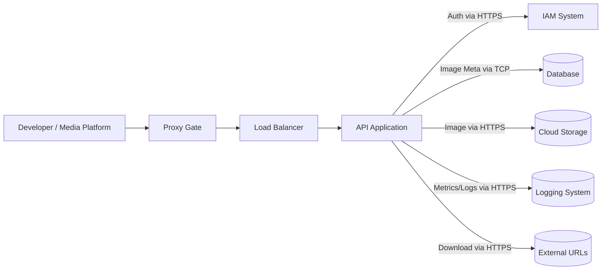

# AsyncImage Fetcher API

**A robust, concurrent, and secure backend API for bulk image downloading, storage, and retrieval. Built with ASP.NET Core 6 and designed for extensibility, security, and performance.**

---

## Table of Contents

* [Project Overview](#project-overview)
* [Features](#features)
* [System Architecture](#system-architecture)
* [Tech Stack](#tech-stack)
* [Getting Started](#getting-started)

  * [Prerequisites](#prerequisites)
  * [Running Locally](#running-locally)
  * [Configuration & Environment Variables](#configuration--environment-variables)
* [Docker Usage](#docker-usage)
* [API Documentation](#api-documentation)
* [Example Workflows](#example-workflows)
* [Extensibility & Scaling](#extensibility--scaling)
* [Testing](#testing)
* [Deployment & Production](#deployment--production)
* [Contributing](#contributing)
* [License](#license)
* [Acknowledgments](#acknowledgments)

---

## Project Overview

**AsyncImage Fetcher API** is a RESTful backend service that lets clients submit a batch of image URLs and concurrently download them, with a configurable limit on simultaneous downloads to ensure optimal resource usage. Each downloaded image is stored with a unique filename, and the API provides endpoints to retrieve images as Base64 strings.

This project was built to demonstrate modern, clean, scalable backend architecture and concurrency management using ASP.NET Core 6 and C#. It is designed as a learning resource, portfolio piece, and a foundation for real-world media/data processing microservices.

---

## Features

* **Bulk Asynchronous Download:** Download multiple images at once, controlling concurrency for efficiency and server safety.
* **Unique File Storage:** Images saved with robust, collision-proof names.
* **Base64 Retrieval:** Retrieve any stored image as a Base64-encoded string via a simple API call.
* **Robust Input Validation:** All requests are validated for correct types, formats, and limits.
* **API Authentication:** Supports JWT authentication and pluggable IAM integrations.
* **Auto-Generated Swagger Documentation:** Built-in OpenAPI spec for testing and client generation.
* **Error Handling & Logging:** Granular feedback per URL, logging for success/failure, and extensible monitoring hooks.
* **Designed for Cloud & Local:** Works out of the box on your machine, in Docker, or on any major cloud provider.
* **Extensible:** Easy to add features like cloud storage, database metadata, or AI-based validation.

---

## System Architecture



### Main Containers

* **Proxy Gate:** First line of defense—rate limiting, request validation, and basic filtering.
* **Load Balancer:** Distributes incoming requests for horizontal scaling and HA.
* **API Application:** Implements all business logic, endpoints, and orchestration.
* **IAM System:** Handles authentication and user/role validation.
* **Database:** Stores image metadata (optional/future).
* **Cloud Storage:** Stores images (optional/future, S3, GCS, etc.).
* **Logging System:** Aggregates logs and metrics for observability.
* **Internet:** Where images are fetched from!

---

## Tech Stack

* **Language & Framework:** C#, ASP.NET Core 6
* **Async/Concurrent:** Async/await, SemaphoreSlim for throttling
* **API Docs:** Swagger/OpenAPI 3.0
* **Containerization:** Docker
* **Database:** Optional, supports PostgreSQL or your choice (via Entity Framework)
* **Logging:** Built-in and supports Serilog, ELK, cloud services
* **Auth:** JWT Bearer tokens, IAM integration
* **Testing:** xUnit/NUnit, Moq
* **Cloud Ready:** Deployable to any Docker-ready cloud provider

---

## Getting Started

### Prerequisites

* [.NET 6 SDK](https://dotnet.microsoft.com/download/dotnet/6.0)
* [Git](https://git-scm.com/)
* [Docker](https://www.docker.com/) (for containerized setup)
* (Optional) [PostgreSQL](https://www.postgresql.org/download/) if you want metadata persistence

---

### Running Locally

1. **Clone the Repository**

   ```bash
   git clone https://github.com/your-username/asyncimage-fetcher-api.git
   cd asyncimage-fetcher-api
   ```

2. **Restore Dependencies**

   ```bash
   dotnet restore
   ```

3. **Configure Environment Variables**

   * Copy `appsettings.Development.json.example` to `appsettings.Development.json` and set any secrets or API keys as needed.
   * (Or, export env variables in your terminal.)

4. **Run the Application**

   ```bash
   dotnet run
   ```

5. **Open Swagger UI**

   * Browse to [http://localhost:5000/swagger](http://localhost:5000/swagger) to test and explore endpoints.

---

### Configuration & Environment Variables

| Variable                 | Purpose                                       | Example Value               |
| ------------------------ | --------------------------------------------- | --------------------------- |
| `ASPNETCORE_ENVIRONMENT` | App environment (`Development`, `Production`) | `Development`               |
| `STORAGE_DIR`            | Path for local image storage                  | `/app/data/images`          |
| `CLOUD_STORAGE_URL`      | Cloud storage endpoint (optional)             | `https://s3.amazonaws.com/` |
| `IAM_ENDPOINT`           | URL for IAM System for token validation       | `https://auth.example.com`  |
| `DATABASE_URL`           | Connection string for DB (optional)           | `Host=localhost;Port=5432`  |
| `LOGGING_ENDPOINT`       | Log aggregation/monitoring URL                | `https://log.example.com`   |

> **Note:** Sensible defaults provided in `appsettings.Development.json`.
> In production, **always** set secrets using env variables or secure secret managers.

---

## Docker Usage

### Building and Running with Docker

1. **Build the Docker image**

   ```bash
   docker build -t asyncimage-fetcher-api .
   ```

2. **Run the container**

   ```bash
   docker run -d -p 5000:5000 \
     -e ASPNETCORE_ENVIRONMENT=Production \
     -e STORAGE_DIR=/app/data/images \
     --name image-api asyncimage-fetcher-api
   ```

3. **Access the API**

   * Visit [http://localhost:5000/swagger](http://localhost:5000/swagger)

#### Sample Dockerfile

```dockerfile
FROM mcr.microsoft.com/dotnet/aspnet:6.0 AS base
WORKDIR /app
EXPOSE 5000

FROM mcr.microsoft.com/dotnet/sdk:6.0 AS build
WORKDIR /src
COPY . .
RUN dotnet restore
RUN dotnet publish -c Release -o /app/publish

FROM base AS final
WORKDIR /app
COPY --from=build /app/publish .
ENTRYPOINT ["dotnet", "AsyncImageFetcher.dll"]
```

---

## API Documentation

**Interactive Swagger/OpenAPI** is provided at `/swagger` when you run the app.

### Main Endpoints

#### `POST /download-images`

* **Body:**

  ```json
  {
    "imageUrls": [
      "https://example.com/image1.jpg",
      "https://example.com/image2.png"
    ],
    "maxDownloadAtOnce": 3
  }
  ```

* **Returns:**

  ```json
  {
    "success": true,
    "message": "All images processed.",
    "urlAndNames": {
      "https://example.com/image1.jpg": "img_20240610_a1b2c3d4.jpg",
      "https://broken.com/image3.jpg": "Failed: 404 Not Found"
    }
  }
  ```

#### `GET /get-image-by-name/{image_name}`

* **Returns:**

  ```json
  {
    "success": true,
    "imageBase64": "/9j/4AAQSkZJRgABAQEASABIAAD/..."
  }
  ```

* **Errors:**

  ```json
  {
    "success": false,
    "message": "Image not found."
  }
  ```

**See full [OpenAPI spec](./openapi.yaml) for all request/response details.**

---

## Example Workflows

**Bulk Download:**

1. POST `/download-images` with a JSON body listing image URLs and desired concurrency.
2. Receive a result object mapping each URL to its stored filename (or error).
3. GET `/get-image-by-name/{image_name}` to retrieve any image as Base64 for use in apps, UIs, etc.

---

## Extensibility & Scaling

* **Cloud Storage:** Swap out local storage for AWS S3, Azure Blob, etc. by implementing an interface.
* **Database Integration:** Easily add DB persistence for image metadata or audit logs.
* **AI/ML Validation:** Add hooks for AI-based content checks or deduplication.
* **More Auth:** Expand to OAuth2, API keys, or SSO providers by updating AuthService.
* **Horizontal Scaling:** Add a Load Balancer and deploy multiple API containers; stateless design makes this trivial.
* **Monitoring:** Plug into Prometheus, ELK, or Grafana for deep visibility.

---

## Testing

* **Unit & Integration Tests:** All business logic is service-layered and covered with xUnit/NUnit and mocks.
* **Postman Collection:** Provided in `/tests` for smoke/end-to-end tests.
* **Performance Testing:** Test high-volume downloads by simulating large POST batches.
* **CI/CD Friendly:** Easily hooks into any pipeline for automatic tests and Docker builds.

---

## Deployment & Production

* **Production Logging:** Use Serilog, cloud logging, or the built-in .NET logger for metrics and alerts.
* **Secrets Management:** Never commit secrets. Use Azure Key Vault, AWS Secrets Manager, or environment variables.
* **Scaling:** Deploy behind a Load Balancer, use multiple app containers, and consider CDN for image serving.
* **Security:** All endpoints require JWT authentication (see `IAM_ENDPOINT`), and input validation is enforced everywhere.
* **Monitoring & Alerts:** Integrate with ELK, Prometheus, Datadog, or similar tools.
* **Backups:** If using a DB or cloud storage, set up scheduled backups.

---

## Contributing

1. **Fork the repository**
2. **Clone your fork**
3. **Create a feature branch**
4. **Push your changes & open a PR**
5. **Describe your changes clearly**

All contributors are welcome! Please follow conventional commit messages and respect the project’s clean code guidelines.

---

## License

This project is licensed under the MIT License. See [LICENSE](LICENSE) for more information.

---

## Acknowledgments

* Built with inspiration from real-world microservice patterns.
* Thanks to the .NET community and OSS library authors.
* Special thanks to all reviewers and contributors!

---

## Contact

Questions, ideas, or want to collaborate?
Open an issue/PR on GitHub!

---

*AsyncImage Fetcher API – Reliable, extensible, and made for real-world scale.*